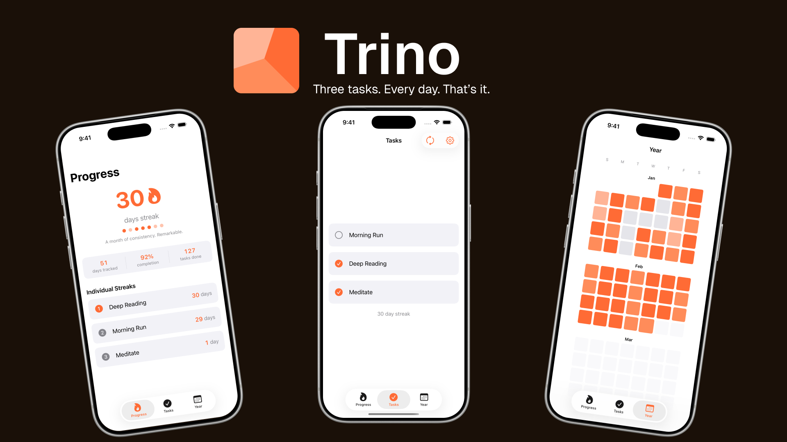

# Trino

A minimalistic iOS habit tracker. Pick three daily tasks, build a streak, and watch the year fill up.

---

## The Idea

I built Trino to keep myself on track. Not with a massive to-do list or a 12-step productivity system — just three things, every day. If I could do that consistently, everything else would follow.

Most habit apps let you track everything. Trino forces a constraint: **three tasks, every day.** Complete at least 2 of 3 and your streak stays alive. Simple rule, surprisingly hard to break.

## Built With

- **SwiftUI** — declarative UI throughout, no UIKit
- **SwiftData** — persistent storage for tasks, daily logs, and entries
- **Swift** — 100%, no third-party dependencies

## Features

- Three fixed daily task slots with full swap/management support
- Streak tracking with per-task and overall productivity streaks
- Year-at-a-glance contribution grid (GitHub-style)
- Accent theme customization (orange, green, teal)
- Configurable week start day
- Onboarding flow for first-time setup

## Architecture Highlights

- `TaskEntry` uses a snapshot model — stores `taskName` and `taskId` at log time so history survives task swaps
- `SettingsStore` is an `@Observable` class backed by `@AppStorage`, kept outside SwiftData intentionally
- `DailyLogService` handles log creation and ensures `TaskEntry` objects are explicitly inserted into the model context
- `StreakService` is a pure stateless struct — no side effects, easy to test
